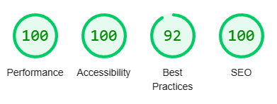

# Welcome to my Project 2 README page

<ul class="navlist">
                <li><a href="#my project 2">My Project 2</a></li>
                <li><a href="#design">Design</a></li>
                <li><a href="#location">Location</a></li>
                <li><a href="#validation">Validation</a></li>
                <li><a href="#tools">Tools</a></li>
                <li><a href="#course">Course</a></li>
                <li><a href="#books">Books</a></li>
                <li><a href="#influences">Influences</a></li>
            </ul>

# [My Project 2](https://quiz.dazl.ie)  General Knowledge Quiz

Hi! My name is Graham. In this README page were you will find out a little about me, my website, my coding journey, my projects and who has influenced me in the development of this website.

This is my second course project, by now I have gained a little experience but still very much a novice. Of the options for this project I thought a quiz would be fun with the challenging bit of writing good questions.

I hope you have fun.

# Design.

For this project I decided to do a quiz as I love a good pub quiz. Quiz's in general can be very enjoyable and hopefully I acheived that. The color scheme for this website is very much tied in with the background image, the chocolate colored font adding some warmth with the light grey adding a bit of contrast. The font used on this project is <u>Cinzel</u>, I choosed this font as I think it adds some sharpness to the overall look. My process of constructing this project was to source all images, including favicon, draw up a mock layout then begin with the HTML. To dress everything up, CSS was added and to make it all dance, Javascript provided all the glitz and glamour.

## <b>Main Page:</b>
The man page has a lovely background of the Trinity College Library with an instruction box in the center containing the quiz start button. A basic main page with only the essentials with a contrasting grren button just waiting to be pressed. In the bottom left contains the copyright and right of that is an animated icon for email contact.

## <b> Questions Page:</b>
The question page has the same background as the main page with the question box centered. This box will contain a question and multiple choice answers. A correct answer will be highlighted in green, an incorrect answer will be red.

## <b>Results Page:</b>
The results page will show the total questions in the quiz, the attemped number, correct and wrong number, the over percentage and the total score.
this page aslo includes both a 'Try again'and 'Go to Home'buttons.

## <b>Favicon:</b>
To finish off the design of this website, I added a favicon of a cartoon brain as a sign of intellegence with a dash of fun.

# Location

All my projects are also available to view on my portfolio website.
[www.dazl.ie](https://quiz.dazl.ie)

# Validation
To ensure the functionality of this project I had 3 tasks.
1. HTML Validation
<input type="checkbox" input checked>
2. CSS Validation
<input type="checkbox" input checked>
3. JSHint Check
<input type="checkbox" input checked>
4. Lighthouse Accessibility
<input type="checkbox" input checked>

The results of these test are shown below:
<ul>
<li>HTML <ul style="list-style-type:circle"><li>No errors returned on W3C HTML validator</li></ul>
</li>
<li>CSS <ul style="list-style-type:circle"><li>No errors returned on W3C CSS validator 
</li></ul>
</li>
<li>Javascript <ul style="list-style-type:circle"><li>No errors returned on JSHint validator</li></ul>
</li>
<li>Accessibility <ul style="list-style-type:circle"><li>On website inspection, lighthouse results are shown below</li></ul>
</li>
</ul>

### Quiz tested on multiple browers such as Chrome, Firefox and Edge with no issues.

# Tools

This project used HTML5, CSS3 and Javascript.

As well as the Code Institute course content, and as with my first project, I got inspiration from some
online tutorials and video's and also books such as  books from Mike McGraths and video tutorials from Mike Dane.

At times I found Javascript challenging and I needed to dig deep into my resourses, thankfully there are so many online tutorials out there to help.

The India based YouTube channel'The WebShala'was of great help on the project with so many helpful and inspiring tutorials. My thanks to The WebShala.

### Font Awesome [Website](https://fontawesome.com/search)
### Boxicons [Website](https://boxicons.com/)
### Github [Website](https://github.com/)
### Slack [Website](https://slack.com/intl/en-ie/)

# Course

## Professional Diploma in Full Stack Software Development
### University College Dublin [Website](https://www.ucd.ie/professionalacademy/why-ucd-professional-academy/)

### Code Institute [Website](https://codeinstitute.net/ie/full-stack-software-development-diploma/?utm_term=code%20institute&utm_campaign=CI+-+IRL+-+Search+-+Brand&utm_source=adwords&utm_medium=ppc&hsa_acc=8983321581&hsa_cam=14304747355&hsa_grp=128775288169&hsa_ad=595155717776&hsa_src=g&hsa_tgt=kwd-342001843376&hsa_kw=code%20institute&hsa_mt=p&hsa_net=adwords&hsa_ver=3&gclid=Cj0KCQjwnvOaBhDTARIsAJf8eVOdV0BAxB5DwdTrFB9AvR5tJ73tLtvCsSeHDsSSq9e1gNbiXiNLTZQaAkyKEALw_wcB)

 

# Books

### Mike McGrath - HTML, CSS & Javascript (Special Edition) [Amazon](https://www.amazon.co.uk/HTML-CSS-JavaScript-easy-steps/dp/184078878X/ref=asc_df_184078878X/?tag=googshopuk-21&linkCode=df0&hvadid=430989472982&hvpos=&hvnetw=g&hvrand=4859645684734044070&hvpone=&hvptwo=&hvqmt=&hvdev=c&hvdvcmdl=&hvlocint=&hvlocphy=20487&hvtargid=pla-921516488553&psc=1&th=1&psc=1&tag=&ref=&adgrpid=97419294662&hvpone=&hvptwo=&hvadid=430989472982&hvpos=&hvnetw=g&hvrand=4859645684734044070&hvqmt=&hvdev=c&hvdvcmdl=&hvlocint=&hvlocphy=20487&hvtargid=pla-921516488553)

### Jon Duckett - HTML & CSS, design and build websites [Amazon](https://www.amazon.co.uk/HTML-CSS-Design-Build-Websites/dp/1118008189/ref=asc_df_1118008189/?tag=googshopuk-21&linkCode=df0&hvadid=310831942794&hvpos=&hvnetw=g&hvrand=9245307914514372249&hvpone=&hvptwo=&hvqmt=&hvdev=c&hvdvcmdl=&hvlocint=&hvlocphy=20487&hvtargid=pla-425752469964&psc=1&th=1&psc=1)

### Jon Duckett - JAVASCRIPT & JQUERY interactive front-end web development [Amazon](https://www.amazon.co.uk/JavaScript-JQuery-Interactive-Front-End-Development/dp/1118531647)

 

